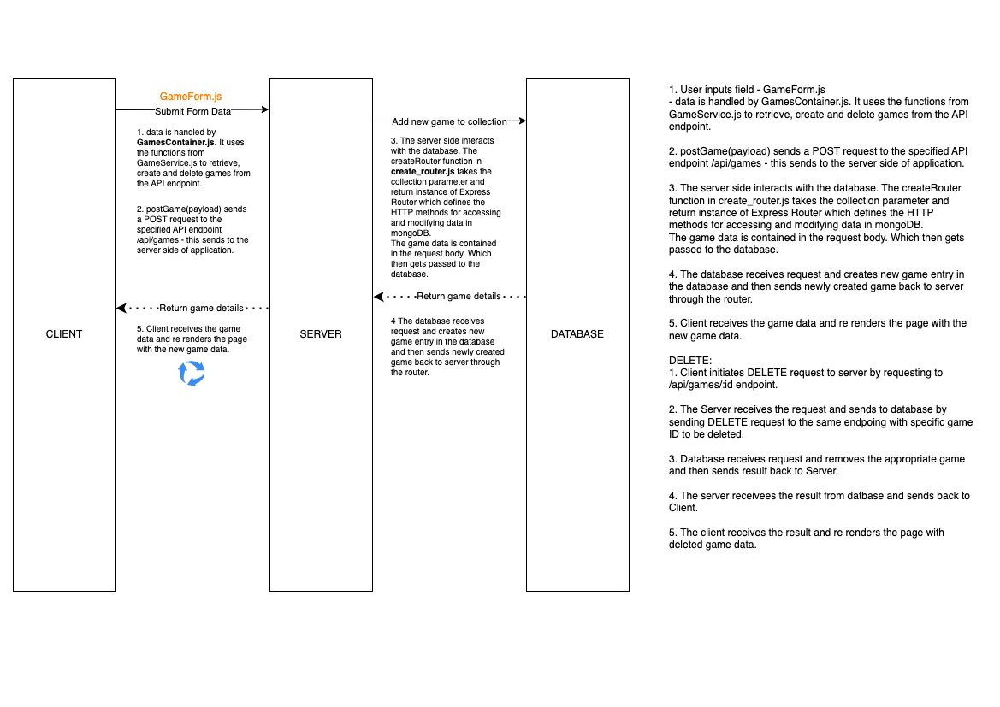

### Diagram

### Questions

1. What is responsible for defining the routes of the `games` resource?
   **The `gamesRouter()` method is responsible. It's defined in the backend code**  

2. What do you notice about the folder structure?  Whats the client responsible for? Whats the server responsible for?
    **The client side is responsible for the user interface and interactions that run on the browser.** 
    **The server side is responsible for handling requests and responses from the client. It interacts with databases, API's and manages any application logic**

3. What are the the responsibilities of server.js?
    **The server.js file is responsible for importing all the necessary dependencies like the express framework which creates the server and connects to the mongoDB database. It also imports a `createRouter()` function that handles the requests to the /api/games endpoint.**

4. What are the responsibilities of the `gamesRouter`?
    **The `gamesRouter` is an instance of the Express router that's created by the `createRouter()` function. It defines the four routes for the /api/games endpoint and specifies the appropriate CRUD functionality that is then performed on the database**

5. What process does the the client (front-end) use to communicate with the server?
   **The client side uses the HTTP requests to communicate with the server. When the user makes a request to the server it sends an HTTP request to the server, processes it, then sends back an an HTTP response**

6. What optional second argument does the `fetch` method take? And what is it used for in this application? Hint: See [Using Fetch](https://developer.mozilla.org/en-US/docs/Web/API/Fetch_API/Using_Fetch) on the MDN docs
    **The fetch method can take an init object which allows you to control a number of different settings such as the request method, headers, and body.**

    **In this application, the getGames() method uses the fetch method with the GET method to get a list of all the games from the server.  The then method extracts the response data in JSON format.**  
    
    **The postGame(payload) method uses the fetch method with the POST method to send a new game object to the server. It gets passed in as payload and then converted to JSON string.  The headers option specifies that the payload is in JSON format.**

    **The deleteGame(id) method uses the fetch method with the DELETE method to delete a game object with matching id from the server. The id gets appended to the base URL to form the complete URL for the delete request.**

7. Which of the games API routes does the front-end application consume (i.e. make requests to)?

    **/api/games and api/games/:id**

8. What are we using the [MongoDB Driver](http://mongodb.github.io/node-mongodb-native/) for?
    **The mongoDB driver is used to interact with the mongoDB database and perform CRUD operations**

## Extension

Why do we need to use [`ObjectId`](https://mongodb.github.io/node-mongodb-native/api-bson-generated/objectid.html) from the MongoDB driver?
 **In mongoDB every record in a collection has a unique _id field. This _id is always of type ObjectId which is a data type used to store mongoDB document ID's.  When a query is made using the ID, the ID string gets converted to Object Id type.  The Object ID method converts this.**
Add to your diagram the dataflow for removing a game.